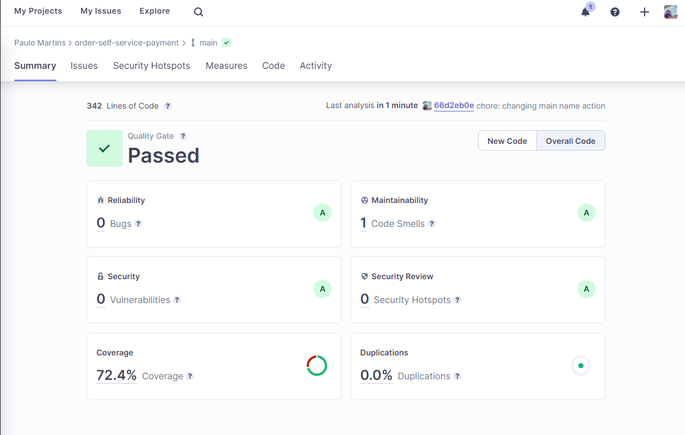

# Microserviço de Pagamento (FIAP Pos-Tech)

## Visão Geral

O Microserviço de Pagamento para a API Principal de Pedidos é uma parte integrante do sistema que oferece funcionalidades de processamento de pagamentos de forma independente. Este microserviço foi projetado para ser integrado à API principal de pedidos, facilitando a manipulação de informações de pagamento associadas a pedidos.

## SonarCloud


## BDD

Dentro da pasta `features` na raiz encontra-se a estrutura do BDD utilizando o `cucumber-js`

## Funcionalidades

- **Criar Pagamento:** Crie novos pagamentos atrelados a uma orderID
- **Atualizar Pagamento:** Atualiza o banco local com a informação do saas de pagamento (neste caso o mercado pago)
- **Recuperar Pagamento:** Traz um pagamento baseado no seu ID

## Endpoints da API

### 1. Criar Pagamento

- **Endpoint:** `/api/`
- **Método:** `POST`
- **Corpo da Requisição:**
  ```json
  {
    "orderId": "order-123-id",
    "transaction_amount": 50,
    "description": "Gerar pagamento para pedido de valor 50 - pedido: order-id-123",
    "installments": 1,
    "payment_method_id": "visa",
    "payer": {
        "email": "test@gmail.com"
    }
  }
  ```

### 2. Atualizar Pagamento

- **Endpoint:** `/api/:id`
- **Método:** `PUT`
- **Corpo da Requisição:**
  ```json
  {
    "id": "1189792",
  }
  ```

### 3. Recuperar Pagamento

- **Endpoint:** `/api/:id`
- **Método:** `GET`

## Formato de Resposta

Todas as respostas da API seguem um formato padrão:

```json
{
  "status": 200,
  "response": {
    "id": "id-123",
    "createdAt": "2023-07-12",
    "orderId": "order-id-123",
    "amount": 50,
    "status": "PENDENTE",
    "externalPaymentId": "external-payment-id-123",
    "updatedAt": "2023-07-12",
  }
}
```

Em caso de erros:

```json
{
  "status": 500,
  "response": {}
}
```